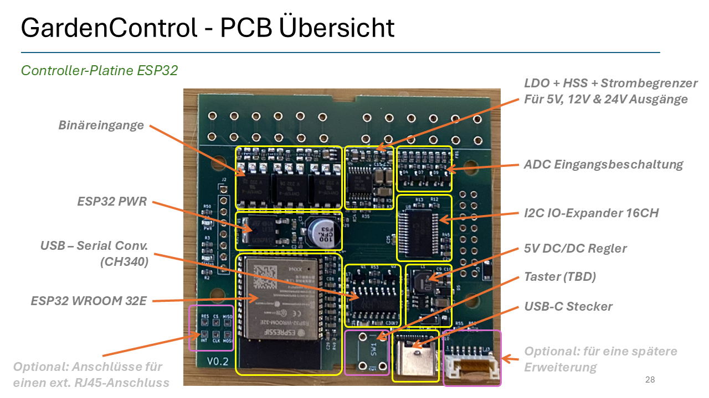
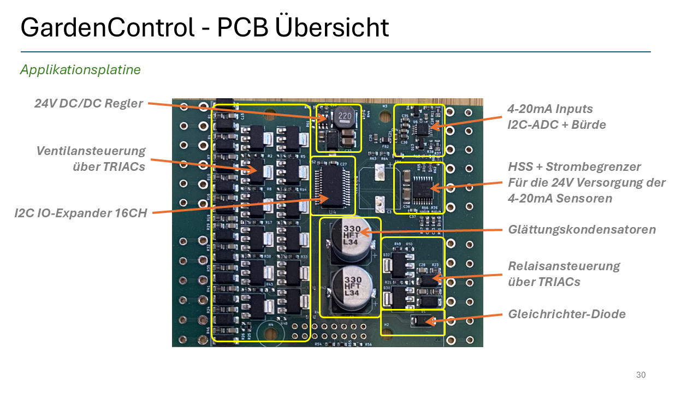

# GardenControl

> The GardenControl is an intelligent watering system to control sprinklers, pumps and sensors. 

+ 12x outputs for valve control (24VAC)
+ 2x outputs for external 230V relais (e.g. for 230V pumps)
+ 2x 4-20mA inputs (for e.g. water level sensors and  each output can provide driectly the 24VDC PWR for the sensor, no additional Power supply necessary)
+ 4x ADC inputs 0-12V (e.g. for Humidity, pressure, temperature, ..., -sensors)
+ 3x Binär-inputs (e.g. for switches, S0-Interface, Rainssensor, ...)

## Connection Diagram

### 24V AC Connection

The GardenControl need a 24VAC Transformer. This Transfomer provide the power for the valves/relays and for all other funktions. No additional PWR-Supply necessary.

NOTE: you have to protect the system always with an external 3A FUSE. In case the transformer has a integrated Fuse (<=3A) it is also fine.  

### Valves Connections

You can connect up to 12 valves. Only 24VAC valves are possible to use! 

NOTE: ensure that the total current consumption of all parallel open valves is always < 3A

### Relay Connections

with two external 24VAC/230VAC Relais you can switch high power devices, e.g. pumps, shut-off valves, ...

### 4-20mA Inputs

Two 4-20mA Inputs are available. Each Input has a separate 24V(DC) power output (short ciruit protected, max 50mA). No additional power supply for the sensors are necessary.   

### Binary-Inputs

Three Binary Inputs are available. The query voltage is 24V(DC) (short circuit protected). 

### ADC-Inputs

Four ADC inputs are available. The voltage range is 0-12V (16Bit resolution). Each Input is protected against overvoltage up to 25V.  
For sensor power supplys the system can provide +5V, 12V, +24V output volatges. Each Power supply output can provide max. 50mA and is proteted against short circuits  

### So-Inputs (not in all Firmware types available) 

## Firmware 

Firmware | Description | Link
-------- | -------- | --------
ESPHome  | Inhalt   | [link ESPhome Yaml](ESPHome_Firmware/esp32-gardencontrol.yaml)
Tasmota   | Inhalt   | [link Tasmota_Firmware](https://gitlab.com/noschFRQ/esp32-gardencontrol)

## Hardware Block-Diagram

## Hardware PCB Overview

