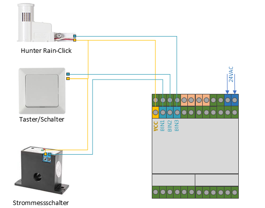
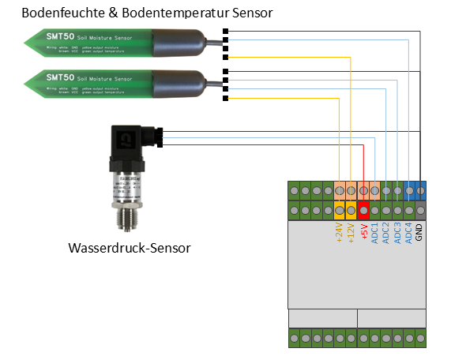
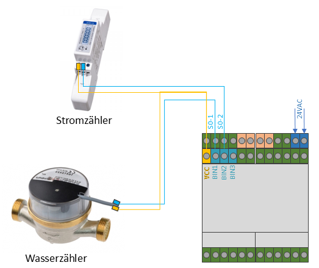

# GardenControl

> The GardenControl is an intelligent watering system to control sprinklers, pumps and sensors. 

+ 12x outputs for valve control (24VAC)
+ 2x outputs for external 230V relais (e.g. for 230V pumps)
+ 2x 4-20mA inputs (for e.g. water level sensors and  each output can provide driectly the 24VDC PWR for the sensor, no additional Power supply necessary)
+ 4x ADC inputs 0-12V (e.g. for Humidity, pressure, temperature, ..., -sensors)
+ 3x Binär-inputs (e.g. for switches, S0-Interface, Rainssensor, ...)

## Connection Diagram

### 24V AC Connection

### Valves Connections

### Relay Connections

### 4-20mA Inputs

### Binary-Inputs

### ADC-Inputs

### So-Inputs (not in all Firmware types available) 

## Firmware 

Firmware | Description | Link
-------- | -------- | --------
ESPHome  | Inhalt   | [link ESPhome Yaml](esp32-gardencontrol.yaml)
Tasmota   | Inhalt   | Inhalt

## Hardware Block-Diagram

